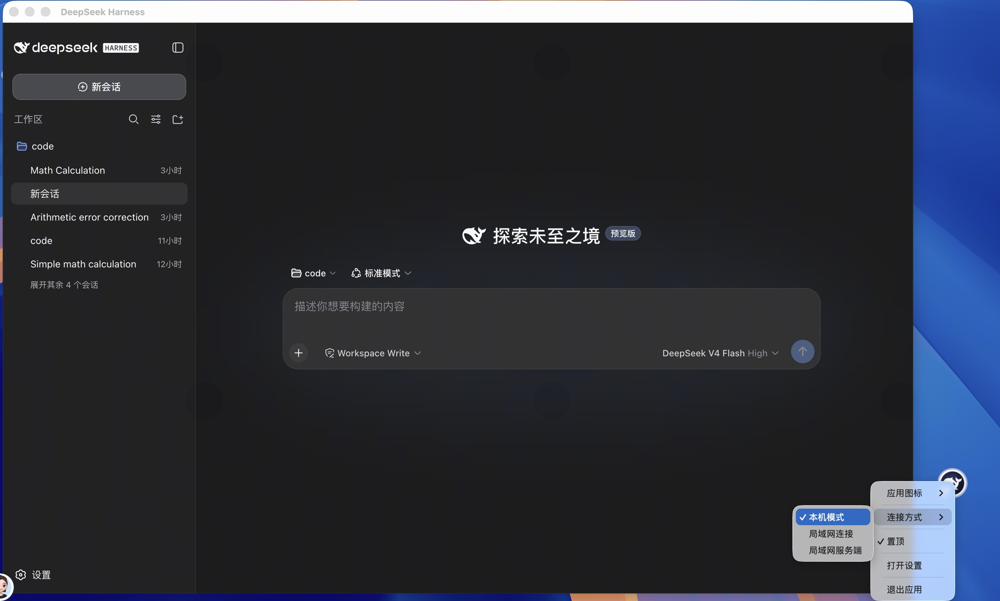
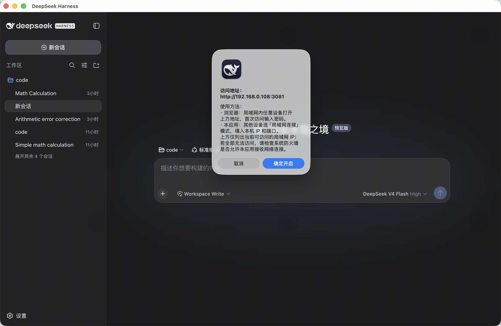
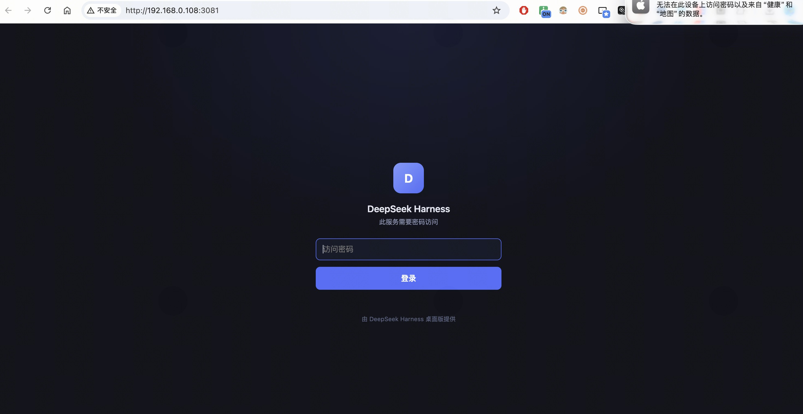
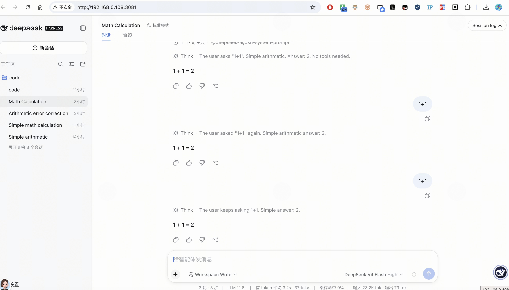
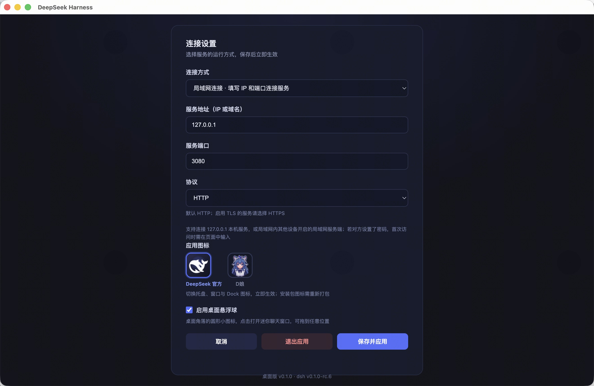
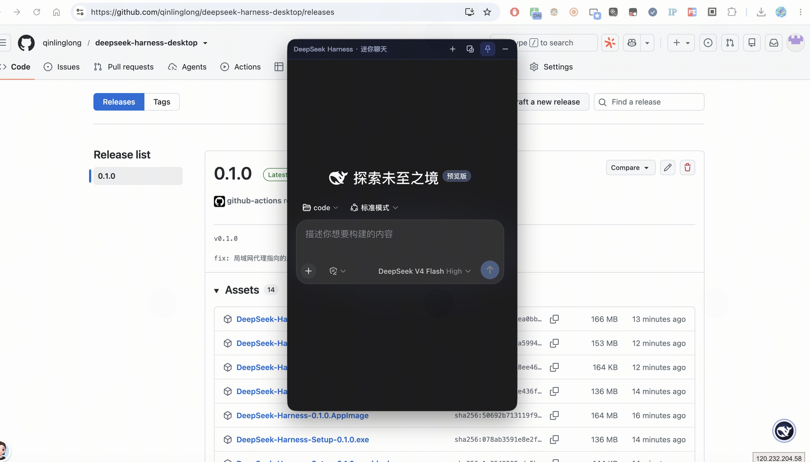

**English** | [中文](README.zh-CN.md)

# DeepSeek Harness Desktop

> Open Source: <https://github.com/qinlinglong/deepseek-harness-desktop>

A cross-platform desktop application (Electron) built on [deepseek-harness](https://github.com/deepseek-ai/deepseek-harness), **no command line required**. The Node.js runtime, `@deepseek-ai/dsh` and all dependencies are bundled — just double-click to run. No Node.js installation or commands needed.

## Highlights

### Three Connection Modes

> Switch anytime from the settings page or the floating ball's right-click menu; changes take effect immediately after saving.

**Local Mode (default)**: Works out of the box — the app bundles a full Agent Harness service. Double-click to start.

<div align="center">
  
</div>

**LAN Server**: Securely share your local Agent with the whole LAN. On enable it auto-detects and shows the accessible `IP + port` address; auto-falls-back to a free port when busy, and filters out unreachable NIC IPs.

<div align="center">
  
</div>

Any device on the LAN can open the address in a browser. First visit shows a login page — enter the access password:

<div align="center">
  
  
</div>

**LAN Connect**: Connect to `127.0.0.1`, or to a LAN server running on another device. Fill in IP + port + protocol (HTTP/HTTPS) and you're connected.

<div align="center">
  
</div>

### Floating Ball & Mini Chat Window

> A white round floating ball docked at the screen corner + a distraction-free mini chat window. Call them up or dismiss them anytime.

**Floating Ball**: Always on top — the fastest entry point.

- **Click**: opens the mini chat window
- **Press & drag**: reposition anywhere (anti-accident design; drag engages after ~0.2s hold)
- **Right-click menu**: switch app icon, connection mode, open settings, or quit — no need to open the main window
- Visible even over fullscreen apps / other applications

**Mini Chat Window**: Hides the sidebar and details panel, keeping only the conversation input area.

- Top toolbar: open main window / pin toggle / collapse
- Optional always-on-top, pairs with the floating ball
- Called up without stealing focus or switching Spaces; IME candidate words display correctly when typing Chinese

<div align="center">
  
</div>

### Ask with Selection

Select any text in the app, right-click and choose "Ask DeepSeek" to ask it as a new session.

### Quick Prompts / Prompt Library

Built-in prompts (summarize, explain code, refactor, fix bugs, translate, etc.), freely editable in settings; one-click fill from the mini window's toolbar button.

### Plugin Market

Browse, install and uninstall deepseek-harness plugins in-app:

- **Multiple sources**: built-in dsh.market and awesome-dsh-plugin.com, plus custom sources via declarative JSON/HTML descriptors
- **In-app install**: bundled pnpm and Node runtime — no system Node/pnpm needed; installs from the npmmirror registry
- **Remote install**: in LAN Connect mode, install/uninstall plugins on a remote desktop server (requires the remote to run LAN Server and a password)
- **Compatibility check**: verifies plugin/SDK version compatibility before installing

### App Icon Switching

> Switch between "DeepSeek (default)" and "D娘" in settings; tray, window, Dock and floating ball icons update instantly.

## Download & Install

Download platform artifacts from [GitHub Releases](https://github.com/qinlinglong/deepseek-harness-desktop/releases):

| Platform | Installer |
|----------|-----------|
| macOS | `DeepSeek-Harness-<version>-arm64.dmg` (or `-mac.zip`) |
| Windows | `DeepSeek-Harness-Setup-<version>.exe` (installer) or `DeepSeek-Harness-<version>-portable.exe` (portable) |
| Linux | `DeepSeek-Harness-<version>.AppImage` or `dsh-desktop_<version>_amd64.deb` |

> **macOS "app is damaged" / "unidentified developer" warning**: the app is not yet Apple-signed or notarized, and unsigned apps from outside the App Store are blocked by Gatekeeper. Choose one:
> - Right-click the app → Open → click "Open" in the confirmation dialog;
> - Or run `xattr -cr "/Applications/DeepSeek Harness.app"` (unzip the zip first, then apply to the `.app`);
> - Signing with an Apple Developer ID certificate removes the warning.

## Global Shortcuts

| Shortcut | Action |
|----------|--------|
| `Cmd/Ctrl+Shift+D` | Open/focus main window |
| `Alt+D` | Toggle mini chat window |
| `Alt+S` | Toggle floating ball |

## Platform Notes

- **Windows**: the installer is unsigned; first run may show "Windows protected your PC" — choose "More info → Run anyway". Some Agent tools depend on bash; **installing [Git for Windows](https://git-scm.com/download/win) (with Git Bash) is recommended**, otherwise tools like terminal/bash may be unavailable.
- **Linux**: AppImage requires FUSE (Debian/Ubuntu: `sudo apt install libfuse2`); the transparent floating ball may render incorrectly under Wayland — X11 session recommended.
- **Tray icon**: relies on system tray support (Windows taskbar / Linux AppIndicator; GNOME needs the AppIndicator extension).

## Security Model

LAN access is protected by two layers:

1. **Password gate**: the app starts a reverse proxy on `0.0.0.0:<lanPort>`; requests without a valid session cookie get the login page. Passwords are stored with scrypt KDF (random salt + high cost; format `scrypt$N$r$p$salt$hash`; legacy sha256 hashes are auto-upgraded on next login). Comparison uses constant-time `crypto.timingSafeEqual`.
2. **dsh browser trust fence**: dsh binds to `127.0.0.1` (random port) and only trusts the machine's LAN IPs via `--trusted-host`. Even with the password, DNS rebinding, cross-site requests, and access through other IPs are rejected by dsh's `/api` fence (403).

> ⚠ In LAN mode, any device knowing the password can operate the local Agent and run commands. Use a strong password and only on trusted networks.

> The remote access password (LAN Connect mode) is stored encrypted via Electron `safeStorage` (macOS Keychain / Windows DPAPI / Linux libsecret); `config.json` never holds it in plaintext. If the system has no encryption backend, it falls back to plaintext with `0600` permissions. The LAN server password itself is stored as a scrypt hash.

## Data & Config

- User data: `~/.dsh` (dsh harness home: profiles / sessions / credentials)
- App config: `<userData>/config.json` (mode, LAN port, password hash, market sources, window bounds)
- Quick prompts: `<userData>/prompts.json`
- Logs: `<userData>/logs/dsh-desktop.log` (auto-rotating, 5MB per file, keeps last 3)
- Config directory:
  - macOS: `~/Library/Application Support/dsh-desktop/`
  - Windows: `%APPDATA%/dsh-desktop/`
  - Linux: `~/.config/dsh-desktop/`

## Development

```bash
npm install
npm start            # dev mode
npm run smoke        # smoke tests (static checks + server boot + DOM render)
```

> ⚠ Maintainer note: `@deepseek-ai/*` **peerDependencies** are not auto-bundled by electron-builder.
> They must be declared explicitly in the root `package.json` `dependencies` (see `cordis-plugin-group`,
> `dsh-fs`, `dsh-shell`, `dsh-subprocess`, etc.). After upgrading `@deepseek-ai/dsh`, if the packaged
> build fails with `ERR_MODULE_NOT_FOUND`, add the missing peer deps as in the dev environment.
> Currently bundled **`@deepseek-ai/dsh@0.1.0-rc.8`** (and all `dsh-*` sub-packages at the same
> version). After upgrading harness, note web UI structure changes: `scripts/dump-dom.js` and the
> `MINI_CSS` in `main.js` follow rc.8's `data-slot` semantics (`sidebar` / `details`).

## Packaging

| Platform | Command | Output |
|----------|---------|--------|
| macOS | `npm run dist:mac` | `release/*.dmg`, `*.zip`, `.app` |
| Windows | `npm run dist:win` | `release/*.exe` (NSIS + portable) |
| Linux | `npm run dist:linux` | `release/*.AppImage`, `*.deb` |

- **Build on the target OS**: Windows/Linux artifacts must be built on their own OS (or CI) after `npm ci`. Native modules (sharp, koffi, node-addon-require-builtin, landlock, etc.) install per-platform via `optionalDependencies` — cross-building from macOS only packages darwin binaries, and the resulting Windows/Linux installers crash at startup for missing `*_win32-x64` / `*_linux-x64` modules.
- Recommended: use the built-in GitHub Actions workflow (`.github/workflows/build.yml`) — a three-OS matrix runs `npm ci` + build on each OS, verifies native modules with `node scripts/verify-native.mjs`, then uploads artifacts.
- Locally, run `node scripts/verify-native.mjs` to quickly check that `release/*-unpacked` contains the native modules for the current platform.
- The app bundles a Node runtime (Electron `ELECTRON_RUN_AS_NODE`); native modules (node-pty, sharp, koffi, etc.) are N-API prebuilds, cross-platform usable (as long as they are installed per-platform as above).
- For signing/notarization, add certificate env vars to the electron-builder config; unsigned builds are fine for internal distribution.

### Auto Release

Push a `v*` tag to trigger the three-OS CI build and auto-create a GitHub Release with all platform installers (auto-published on success).

```bash
git tag v0.1.4 && git push origin v0.1.4
```

## Directory Layout

```
main.js                Electron main process: service orchestration, LAN reverse proxy, auth, floating ball / mini window, plugin install
preload.js             Main-window renderer bridge (exposed only on file: pages to prevent remote pages abusing local capabilities)
renderer/index.html    Splash + connection settings + plugin market UI
renderer/floating.*    Floating ball (drag / click / context menu)
renderer/mini.*        Mini chat window (webview + toolbar + quick prompts)
scripts/native-float.js macOS native bridge (koffi + AppKit: floating-ball always-on-top, mini-window IME solution)
scripts/market.js      Plugin market declarative parsing engine + pnpm self-contained installer
scripts/smoke.cjs      Smoke tests (static checks / server boot / DOM render / PNPM self-containment)
scripts/verify-native.mjs  Verify packaged native modules present (CI)
assets/icons/          App icons (DeepSeek (default) / D娘)
assets/                UI screenshots (README images)
build/                 Build icon
.github/workflows/build.yml  Three-OS matrix build workflow
```

## License

MIT. DeepSeek Harness is developed by DeepSeek AI; this repository is a packaging wrapper only.
